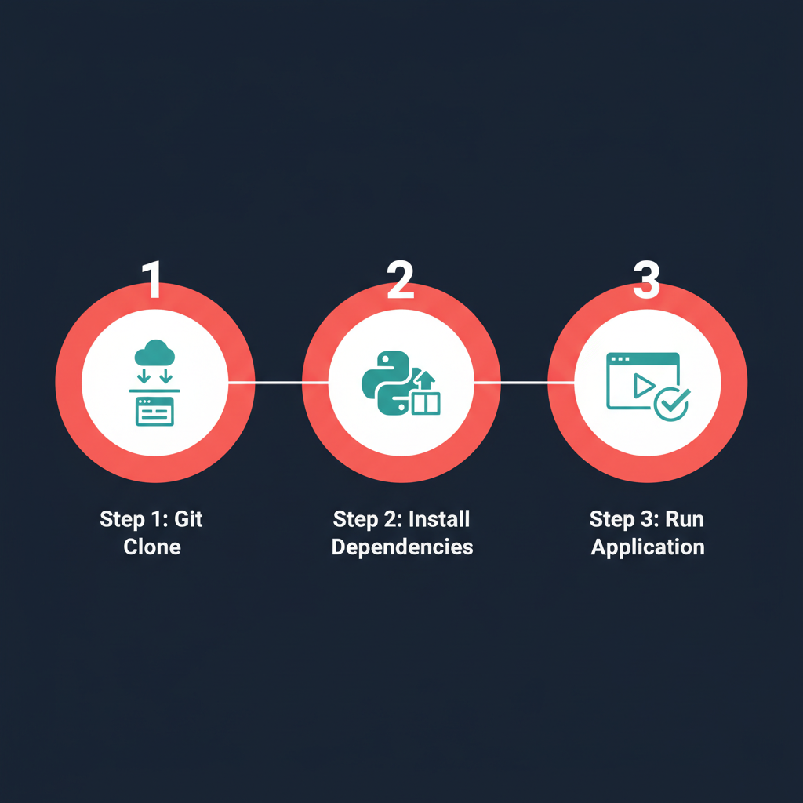
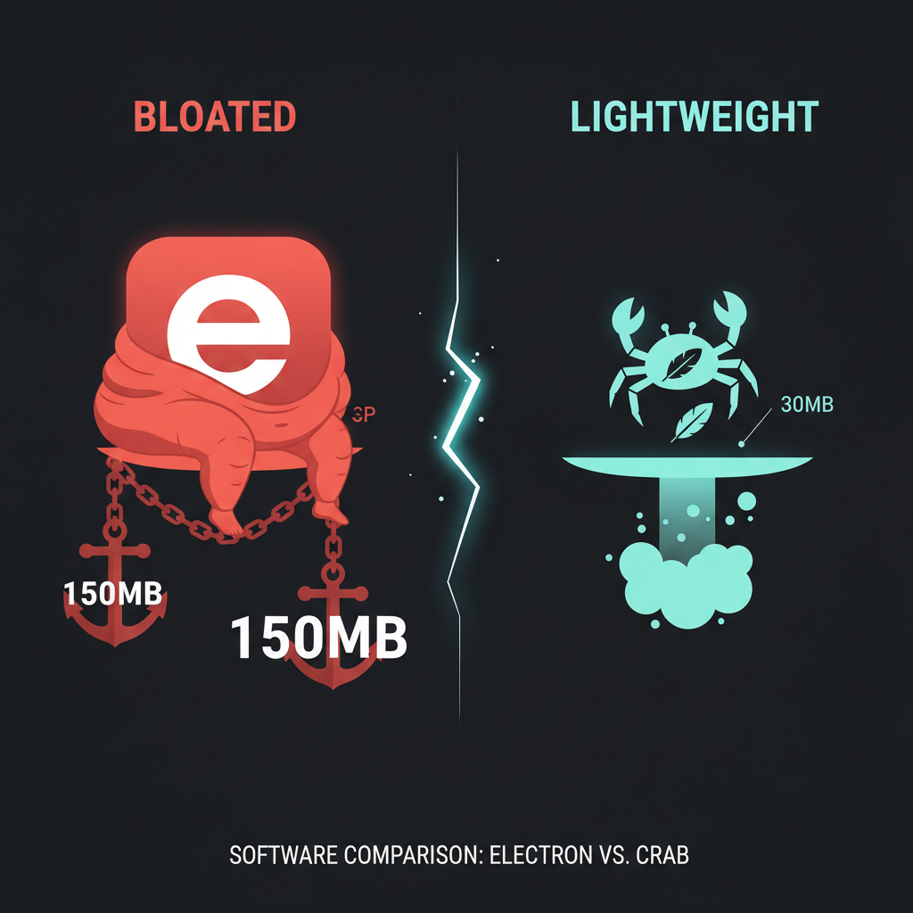

<p align="center">
  
</p>

<h1 align="center">Pinch</h1>
<p align="center">Real-time Claude usage monitor for your Windows taskbar.</p>

<p align="center">
  <a href="../../actions/workflows/release.yml"></a>
  <a href="../../releases/latest"></a>
  
  
  
  
</p>

---

A small taskbar pill that shows your Claude subscription utilization, a live countdown to your next reset, and your weekly quota — color-coded so you know at a glance whether to keep going or ease up.

<p align="center">
  
</p>

---

## What You See

<p align="center">
  
</p>

- **Taskbar pill** — current utilization %, reset countdown, weekly usage. Green/yellow/red at a glance.
- **Detail popup** — click the pill for 5-hour rolling, 7-day Opus, 7-day Sonnet, and extra usage ($) with progress bars and reset timers.
- **Settings** — right-click the tray icon to adjust polling speed (15s–2min), auto-start with Windows, or test your connection.

---

## Install

<p align="center">
  
</p>

**Run from source** (recommended):
```bash
git clone https://github.com/DarkCandyLord/pinch.git
cd pinch
pip install -r requirements.txt
python -m pinch
```

**Or install via pip:**
```bash
pip install pinch-monitor
pinch
```

<details>
<summary><strong>Or download the exe</strong></summary>

Grab `Pinch.exe` from [Releases](../../releases/latest). Requires Windows 10/11 and [Claude Code](https://docs.anthropic.com/en/docs/claude-code) authenticated.

This binary is built by [GitHub Actions](.github/workflows/release.yml) from the public source code — not on anyone's personal machine. Every release includes a SHA256 checksum for verification.

> **Note:** Windows SmartScreen may warn about an unrecognized app. This is normal for new open-source tools. Click "More info" → "Run anyway", or [build from source](#install) instead.

</details>

Pinch reads your existing Claude Code OAuth session automatically. No API keys to paste, no config files, no accounts to create.

---

## Why This Exists

<p align="center">
  
</p>

macOS already has [half a dozen native Claude usage trackers](https://github.com/topics/claude-usage). Windows had almost nothing — one Electron-based widget at 150MB+.

Pinch is the lightweight alternative: ~2,500 lines of Python, 30MB exe (no Electron), zero dependencies beyond the standard library and three small packages.

---

## Security & Trust

<p align="center">
  
</p>

Pinch touches your OAuth token, so you should understand exactly what it does:

- **The only network call** is to `api.anthropic.com/v1/organizations/{org}/usage` — the same endpoint Claude Code uses. Nothing else. No analytics, no tracking, no phone-home.
- **Your token is read live** from `~/.claude/.credentials.json` each poll cycle and immediately discarded. It is never written to disk, cached, or sent anywhere except Anthropic's API.
- **No backend.** There is no Pinch server. Everything runs on your machine.
- **Fully auditable.** The entire codebase is ~2,500 lines of Python across 17 files. The auth logic is in [`auth.py`](src/pinch/auth.py) (67 lines). The API call is in [`usage_api.py`](src/pinch/usage_api.py) (97 lines). Read them yourself.

| | |
|---|---|
| Source | ~2,500 lines of Python |
| Exe size | ~30 MB |
| RAM usage | ~15 MB |
| Dependencies | 3 ([pystray](https://pypi.org/project/pystray/), [Pillow](https://pypi.org/project/pillow/), [certifi](https://pypi.org/project/certifi/)) |
| Network | `api.anthropic.com` only |
| Data stored | Display preferences in `%LOCALAPPDATA%/Pinch/` |

---

<details>
<summary><strong>Common Questions</strong></summary>

**Does this work without Claude Code?**
Not yet. Pinch reads the OAuth session that Claude Code creates. If Claude Code isn't installed, the setup wizard tells you what to do.

**Will this slow down my computer?**
No. ~15 MB of RAM, one API call every 30 seconds (configurable). You won't notice it.

**Can I change the polling interval?**
Yes. Right-click the tray icon → Settings → pick 15s, 30s, 60s, or 2 minutes.

**Why is the exe 30MB?**
PyInstaller bundles the entire Python runtime. The actual source code is ~50KB. If you have Python installed, `pip install pinch-monitor` avoids the bundled runtime entirely.

**Why is it called Pinch?**
Crabs pinch. Claws grip. You should know when you're about to get clamped by your rate limits. Also — it's small. It pinches onto your taskbar and doesn't let go.

</details>

---

## Contributing

See [CONTRIBUTING.md](CONTRIBUTING.md). PRs welcome — especially for Linux/macOS support.

---

<p align="center">
  <sub>MIT License · Built by <a href="https://github.com/DarkCandyLord">DarkCandyLord</a></sub>
</p>
