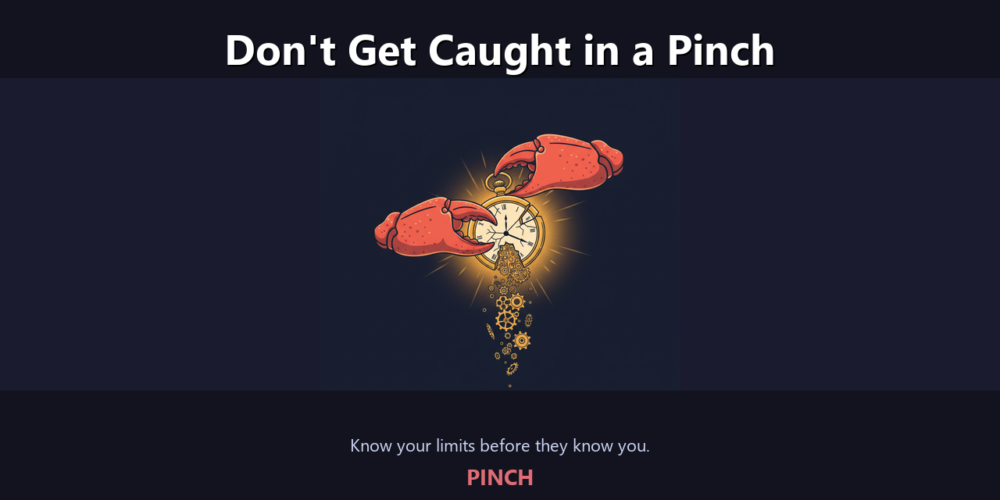
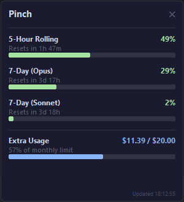
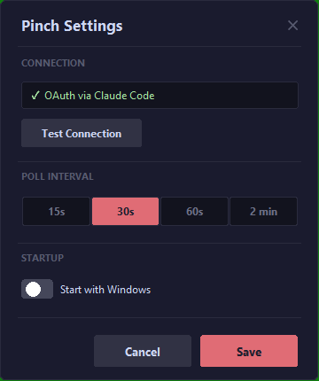

<p align="center">
  
</p>

<h1 align="center">Pinch</h1>
<p align="center"><strong>Stop guessing. Start seeing your Claude limits in real-time.</strong></p>

<p align="center">
  
  
  
  
</p>

---

You're three hours into a coding session. Context is loaded. You're on a roll. Then —

> *"Please try again later."*

You just hit a rate limit you didn't see coming. Your flow is gone. Your context is stale. And you have no idea when it resets.

**Pinch sits on your taskbar and makes sure that never happens again.** One glance tells you exactly how much runway you have left — so you can pace yourself, switch models, or wrap up before the wall hits.

<p align="center">
  <a href="../../releases/latest"></a>
</p>

---

## See It In Action

### Always know where you stand
A compact pill lives on your taskbar showing your current utilization percentage, a live countdown to your next reset, and your weekly usage. The color tells you everything: **green** means you're clear, **yellow** means ease up, **red** means stop and wait.

<p align="center">
  
</p>

### Every metric, one click away
Click the pill for the full breakdown: 5-hour rolling window, 7-day Opus quota, 7-day Sonnet quota, and extra usage credits — each with its own progress bar and reset timer. No more guessing which limit you're closest to.

<p align="center">
  
</p>

### Set it and forget it
Right-click the tray icon to open settings. Choose how often Pinch checks (15 seconds to 2 minutes), set it to launch with Windows, or test your connection. Configure once, then it just works.

<p align="center">
  
</p>

---

## Running in 30 Seconds

You need [Claude Code](https://docs.anthropic.com/en/docs/claude-code) installed. That's the only prerequisite.

```
1. Download Pinch.exe from Releases
2. Double-click it
3. That's it — you're monitoring
```

Pinch finds your Claude Code session automatically. No API keys. No config files. No account creation. It reads your existing OAuth token, checks your usage, and starts displaying it. Done.

<p align="center">
  <a href="../../releases/latest"><strong>Download Pinch.exe</strong></a>
</p>

---

## The Problem Pinch Solves

| Sound familiar? | What Pinch does about it |
|-----------------|--------------------------|
| "I got rate limited mid-conversation and lost my flow" | Watch your usage climb in real-time — pace yourself before you hit the wall |
| "I have no idea when my limit resets" | Live countdown timer, always visible on your taskbar |
| "I forgot to check my weekly Opus quota" | Color-coded pill turns yellow when you're getting close, red when you're done |
| "I burned through my extra credits without realizing it" | Dollar amounts shown — see exactly what you've spent out of your $20 cap |

---

## Your Data Stays on Your Machine

Pinch is built with a simple rule: **the only server it talks to is Anthropic's.**

- **Zero telemetry** — no analytics, no tracking, no phone-home
- **No credentials stored** — your OAuth token is read live from Claude Code's session file and immediately discarded after each check
- **No backend** — there is no Pinch server. Everything runs locally
- **Tiny footprint** — ~15 MB of RAM, polls every 30 seconds, sits quietly in your system tray

You can read every line of source code yourself:

| | |
|--------|-------|
| Language | Python 3.10+ |
| UI | tkinter (standard library) |
| Tray | pystray + Pillow |
| Exe Size | ~30 MB |
| Dependencies | 3 total |
| Network Calls | `api.anthropic.com` only |
| Data Stored | Display preferences only |

---

## Build from Source

```bash
git clone https://github.com/DarkCandyLord/pinch.git
cd pinch
pip install -r requirements.txt

python -m pinch              # Run directly
python -m pinch --test-api   # Test your connection
build.bat                    # Package as Pinch.exe
```

Requires Python 3.10+, Windows 10/11, and an authenticated Claude Code session.

---

## Common Questions

**Does this work without Claude Code?**
Not yet. Pinch reads the OAuth session that Claude Code creates. If Claude Code isn't installed, the setup wizard tells you exactly what to do.

**Does this send my data anywhere?**
No. The only network call is to `api.anthropic.com` — the same endpoint Claude Code uses. Nothing leaves your machine otherwise.

**Will this slow down my computer?**
No. It uses about 15 MB of RAM and checks once every 30 seconds. You won't notice it's running.

**Can I change how often it checks?**
Yes. Right-click the tray icon, open Settings, and pick your interval: 15s, 30s, 60s, or 2 minutes.

**Why is it called Pinch?**
Crabs pinch. Claws grip. And you should know when you're about to get clamped by your rate limits. Also — it's small. It pinches onto your taskbar and doesn't let go.

---

<p align="center">
  <sub>MIT License &bull; Built by <a href="https://github.com/DarkCandyLord">DarkCandyLord</a></sub>
</p>
